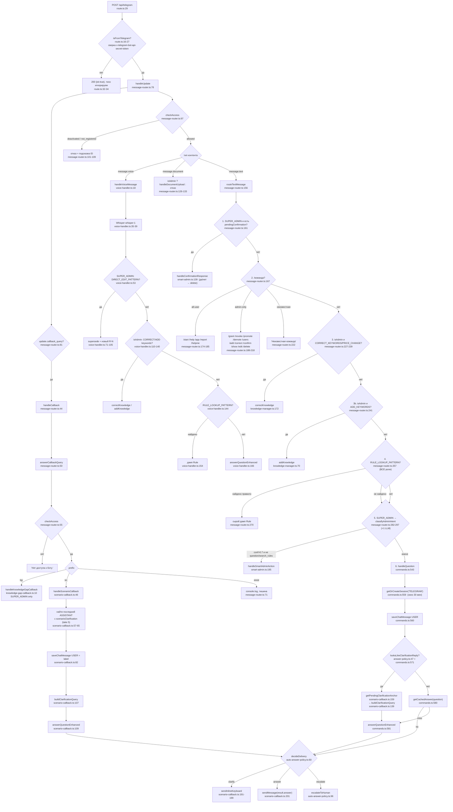

# Контур №1 — Telegram-бот (@avroratranslatebot): полная трассировка пути к ответу

> Технический аудит, read-only. Дата: 2026-07-30. Ветка `master`, коммит `d29c49c`.
> Все утверждения подкреплены ссылками `путь/файл.ts:строка`. Где что-то не найдено — явно написано «не найдено».
> Файл `src/lib/telegram/auto-answer-policy.ts` прочитан с диска в текущем (только что переписанном) состоянии.

---

## 0. Краткое резюме (10 строк)

1. До движка ответов стоит **6 последовательных развилок** (pending-confirm → слэш-команды → admin-keywords → rule-lookup → intent SUPER_ADMIN → Q&A), из них 3 доступны только админам, но `RULE_LOOKUP_PATTERN` перехватывает сообщения **всех** ролей (`message-router.ts:257`).
2. Внутри `answerQuestionEnhanced` — **7 источников ответа** с жёстким приоритетом; первым реально отвечающим является canonical Q&A override, а сценарный гейт при этом уже потратил LLM-вызов (`enhanced-answering-engine.ts:518` → `:531`).
3. Порог канонического override — `overlap >= 0.55` по инфлированному набору term-вариантов (`:439`); порог «сильного» QA-матча — `0.7` / `0.6` для authority-пар (`:821`).
4. Boost авторитета: `VOICE_ANSWER_AUTHORITY`/`HISTORICAL_ANSWER_AUTHORITY` = **+30**, `VOICE_AUTHORITY` правила = **+40/+20/+8** (`:379`, `:387`, `:390`).
5. Гибридный поиск — RRF с `k=60` и весом семантики `0.7`; итоговый `combinedScore` ≈ 0.01–0.017, поэтому уверенность считается **не по нему**, а по `semanticScore` (`vector-search.ts:398,439`; `enhanced-answering-engine.ts:831`).
6. Читаются 8 таблиц: `DocChunk`, `Document`, `Rule`, `QAPair`, `ChatSession`, `ChatMessage`, `TelegramUser`, `AISettings` (+ запись `HallucinationLog`, `AIQuestion`).
7. **LLM-вызовов на один ответ: 6 минимум, до 8–10** (сценарий, expand, entities, intent, синтез, верификация, регенерация, ре-верификация); голос добавляет Whisper, SUPER_ADMIN — ещё один классификатор.
8. Политика доставки унифицирована: `decideDelivery()` (`auto-answer-policy.ts:60`) — единая для текста, голоса и кнопок; порядок `clarify` → `answer` → `escalate`.
9. Главная протечка: **self-improving loop мёртв в Telegram** — `escalateUnconvincingAIAnswer` вызывается только после того, как ответ прошёл гейт, а низкодоверенные ответы уходят в `escalateToHuman` и возвращаются раньше (`commands.ts:587-592`).
10. Вторая протечка: **голосовой путь не поддерживает уточнения** — кнопки не отправляются, метаданные якоря не сохраняются, диалог обрывается (`voice-handler.ts:174-182`).

---

## 1. Диаграмма пути (полное дерево)



### Внутренний конвейер `answerQuestionEnhanced` (порядок исполнения)

```
enhanced-answering-engine.ts:504  answerQuestionEnhanced(question, sessionId, includeDebug=false)
│
├─ Step 0  :518  classifyScenario(question)                        ← LLM #1 (если не сработал детерминизм)
│          :522-525  catch → scenarioDecision = out_of_scope
│
├─ ★ :531  findCanonicalQaOverride(question)                       ← только БД (QAPair take 200)
│          :532-535  МАТЧ → buildCanonicalQaResult → polishCanonicalAnswer ← LLM #2 → RETURN (confidence 1.0)
│
├─ :539  kind === 'needs_clarification'
│          :540  buildDeterministicGuardrailResult → если не null, RETURN
│          :542  buildClarificationResult → RETURN (кнопки)
│
├─ :556  kind === 'out_of_scope'
│          :557  buildDeterministicGuardrailResult → если не null, RETURN
│          :560  !isBureauTopic → buildOutOfScopeResult → RETURN («нет данных»)
│          :565-569  бюро-тема → переклассификация в knowledge_lookup (открытый поиск)
│
├─ Step 1  :589-593  Promise.allSettled([expandQuery, extractEntities, classifyIntent])   ← LLM #2,#3,#4
├─ Step 2  :615-620  allQueries = question + expandAbbreviations + variants + детерминированные варианты
├─ Step 3  :628-633  multiQuerySearch(allQueries, [], 10, scenarioAncestors)  → hybridSearch на каждый вариант
│          :645-649  Document.findMany (заголовки)
├─ Step 4  :656  selectContextChunks(chunks, 5)
│          :679-689  выбор primary-документа по СУММЕ semanticScore
├─ Step 5  :723-752  Rule: per-term (take 25 × ≤12) + top-100 by confidence → rankByQuestion → slice(0,10)
├─ Step 6  :767-799  QAPair: per-term (take 25 × ≤12) + top-100 by createdAt → rankByQuestion → slice(0,5)
│          :811-821  bestQaMatch / bestAuthorityQaMatch → hasStrongQaMatch
├─ Step 7  :831-839  overallConfidence = min(max(bestSemanticScore, hasStrongQaMatch ? bestQaMatch : 0), 1.0)
├─ Step 8  :846-866  confidenceLevel: high / medium / low / insufficient
├─ :870  buildEnhancedContext(chunks, rules, qaPairs)
├─ :872  insufficient && !hasStrongQaMatch && shouldUseGeneralKnowledgeFallback
│          :873  guardrail → если не null, RETURN
│          :876  answerFromGeneralKnowledgeFallback → LLM #5 → RETURN (answerSource='general_ai')
├─ Step 9  :896-914  синтез ответа, temperature 0                  ← LLM #5
├─ Step 9.5 :931  если chunks>0 и level != insufficient:
│          :945  verifyAnswer(answer, chunks+rules+qa)             ← LLM #6
│          :955-976  если есть unsupported → регенерация            ← LLM #7
│          :984  ре-верификация нового текста                       ← LLM #8
│          :991-1002  запись в HallucinationLog (fire-and-forget)
├─ :1018-1023  requiresHumanReview = verificationFailed || unsupported || answerSignalsKnowledgeGap || compositeCapabilityRisk
└─ :1082-1137  сборка EnhancedAnswerResult (answerSource='knowledge_base')
```

---

## 2. Пункт 1 — Все развилки маршрутизации до движка ответов

### 2.1 Транспортный уровень

| # | Условие | Файл:строка | Кто может задеть | Что дальше |
|---|---|---|---|---|
| 0.1 | Заголовок `x-telegram-bot-api-secret-token` не совпал с `TELEGRAM_WEBHOOK_SECRET` (timing-safe) | `route.ts:16-27`, `:32-34` | кто угодно извне | `200 {ok:true}`, обработка не запускается. Если переменная не задана — **весь трафик отбрасывается** (`route.ts:18-22`) |
| 0.2 | Первый запрос после старта процесса | `route.ts:37-41` | все | ленивая регистрация `setBotCommands` + `setMenuButton` |
| 0.3 | `update.callback_query` присутствует | `message-router.ts:81` | все с доступом | ветка кнопок (см. 2.2) |
| 0.4 | `checkAccess(telegramId)` | `message-router.ts:97`, `access-control.ts:23-88` | все | нет записи в `TelegramUser` или `isActive=false` → отказ; `telegramId === TELEGRAM_SUPER_ADMIN` → авто-создание SUPER_ADMIN (`access-control.ts:34-45`) |
| 0.5 | `message.voice` | `message-router.ts:120` | все роли | `handleVoiceMessage` |
| 0.6 | `message.document` | `message-router.ts:126` | ADMIN+ (иначе отказ `:130`) | `handleDocumentUpload` |
| 0.7 | `message.text` | `message-router.ts:136` | все | `routeTextMessage` |

### 2.2 Ветка inline-кнопок (`handleCallback`, `message-router.ts:44-72`)

| Префикс | Файл:строка | Роль | Действие |
|---|---|---|---|
| `kg:` | `message-router.ts:61` → `knowledge-gap-callback.ts:10` | **только SUPER_ADMIN** (`knowledge-gap-callback.ts:17`) | `approve` → `approveKnowledgeGap` создаёт ACTIVE `QAPair` с `metadata.origin='ai-suggested'` (`knowledge-feedback.ts:158-173`); `reject` → `AIQuestion.status='DISMISSED'` |
| `sc:` | `message-router.ts:66` → `scenario-callback.ts:46` | все с доступом | реконструкция «оригинал + цепочка уточнений» → повторный вызов движка |
| прочее | `message-router.ts:71` | — | только `console.log`, пользователю ничего не отправляется (мёртвая ветка) |

### 2.3 Текстовый путь `routeTextMessage` (`message-router.ts:156-301`) — полный упорядоченный список

**Развилка 1 — pending confirmation** (`message-router.ts:161`)
- Условие: `isSuperAdmin(user.role) && hasPendingConfirmation(chatId)`.
- Роль: **только SUPER_ADMIN**.
- Состояние: in-memory `Map<number, PendingConfirmation>` с TTL 5 минут (`smart-admin.ts:37,39,127-137`).
- Дальше: `handleConfirmationResponse` (`smart-admin.ts:139`); «да/yes/ок/ok/подтверждаю/удали/удаляй» (`smart-admin.ts:149`) → `executeDeleteRule` / `executeDeleteDocument`, всё остальное → «Операция отменена».
- **Побочный эффект:** пока висит подтверждение, любой текст суперадмина съедается этой веткой, включая обычные вопросы.

**Развилка 2 — слэш-команды** (`message-router.ts:167`, regex `/^\/(\w+)(?:\s+([\s\S]*))?$/`)
- Доступные всем: `/start` `/help` `/app` `/report` `/helpme` (`message-router.ts:174-185`).
- Только ADMIN+: `grant, revoke, promote, demote, users, add, correct, confirm, show, edit, delete` (`message-router.ts:188-218`); проверка `isAdmin` на `:189-193`, дополнительная проверка `isSuperAdmin` внутри `/promote` и `/demote` (`commands.ts:170`, `:191`).
- Неизвестная команда → сообщение `message-router.ts:222`.
- Примечание: `\w` не матчит кириллицу, поэтому `/справка` уйдёт мимо матча и попадёт в развилки 3–6.

**Развилка 3 — admin-keyword перехват CORRECT/PRICE** (`message-router.ts:227-239`)
- Условие: `isAdmin(user.role) && (CORRECT_KEYWORDS.test(text) || PRICE_CHANGE_PATTERN.test(text))`.
- `CORRECT_KEYWORDS` (`constants.ts:25-26`) содержит вторую альтернативу `(.*\s(теперь|стало|было|изменилось|поменялось)\s.*)`, срабатывающую **в любом месте строки**.
- Дальше: `correctKnowledge(text, telegramId)` (`knowledge-manager.ts:172`) — читает 100 последних ACTIVE-правил, отдаёт их LLM целиком, пишет `Rule` in-place с `confidence=1.0`, депрецирует связанные `QAPair`, удаляет «конфликтующие» чанки (`knowledge-manager.ts:223-251`, `:303-337`).
- Роль: ADMIN и SUPER_ADMIN.

**Развилка 3b — admin-keyword перехват ADD** (`message-router.ts:241-253`)
- Условие: `isAdmin && ADD_KEYWORDS.test(text)`, якорь `^` (`constants.ts:19-20`).
- Дальше: `addKnowledge` (`knowledge-manager.ts:70`) — создаёт `Rule` (confidence 0.9), `QAPair`, виртуальный `Document` + `DocChunk` с эмбеддингом (`knowledge-manager.ts:394-437`).

**Развилка 4 — прямой lookup правил** (`message-router.ts:257-274`)
- Условие: `RULE_LOOKUP_PATTERN` (`constants.ts:44`): `/(?:правил[оа]\s+(?:R-|r-|р-)?|(?:R|r|р)-?)(\d+)/i`.
- Роль: **все, включая обычных USER** — единственная не-админская развилка перед Q&A.
- Запрос: `Rule.findFirst({ ruleCode, status:'ACTIVE' })` (`message-router.ts:262-265`).
- Найдено → сырой дамп «код + уверенность + title + body» (`message-router.ts:270`), **без полировки и без гейтов доставки**.
- Не найдено → проваливается дальше (`message-router.ts:273`).

**Развилка 5 — классификация интента для SUPER_ADMIN** (`message-router.ts:282-297`)
- Условие: `isSuperAdmin(user.role)`; вызывается `classifyAdminIntent` (`smart-admin.ts:89`, LLM, `temperature 0.1`, `maxTokens 256`).
- Маршрутизация: `classified.confidence > 0.7 && intent ∉ {question, search_rules}` → `handleSmartAdminAction` (`message-router.ts:289-291`).
- `search_rules` и `question` сознательно **не** перехватываются — они уходят в общий Q&A (комментарий `message-router.ts:276-281`).
- Ошибка классификации → `catch` и проваливание в Q&A (`message-router.ts:293-296`).

**Развилка 6 — общий Q&A** (`message-router.ts:300` → `commands.ts:543`)

### 2.4 Голосовой путь `handleVoiceMessage` (`voice-handler.ts:18-187`)

Порядок отличается от текстового:

| # | Условие | Файл:строка | Роль |
|---|---|---|---|
| V0 | Скачивание файла + Whisper `whisper-1`, `language: 'ru'` | `voice-handler.ts:30-39` | все |
| V0b | Пустая транскрипция → «Не удалось распознать речь» | `voice-handler.ts:43-46` | все |
| V0c | Эхо «Распознано: …» | `voice-handler.ts:49` | все |
| V1 | `DIRECT_EDIT_PATTERN` (`constants.ts:36-37`) | `voice-handler.ts:53-107` | **только SUPER_ADMIN** — supersede старого правила + создание нового с `confidence 1.0` |
| V2 | `CORRECT_KEYWORDS \|\| PRICE_CHANGE_PATTERN` | `voice-handler.ts:110-115` (SUPER_ADMIN), `:127-132` (ADMIN) | ADMIN+ |
| V3 | `ADD_KEYWORDS` | `voice-handler.ts:118-124` / `:134-140` | ADMIN+ |
| V4 | `RULE_LOOKUP_PATTERN` | `voice-handler.ts:144-158` | все |
| V5 | Q&A: `getOrCreateSession` → `saveChatMessage USER` → `answerQuestionEnhanced` → `decideDelivery` | `voice-handler.ts:163-182` | все |

**Отличия голоса от текста (важно):** нет `pendingConfirmation`, нет слэш-команд, нет `classifyAdminIntent`, **нет кэша ответов**, **нет** `escalateUnconvincingAIAnswer`, **нет** поддержки уточняющих кнопок и якоря уточнений.

### 2.5 Путь кнопки сценария `handleScenarioCallback` (`scenario-callback.ts:46-130`)

1. `getOrCreateSession('TELEGRAM', telegramId)` — `:52`.
2. Последние 5 ASSISTANT-сообщений, поиск первого с `metadata.scenarioClarification.options.length` — `:57-65`. Не найдено → «Не нашёл контекст…» — `:67-73`.
3. Резолв нажатой опции по `id` → `label`; неизвестный id деградирует в сам id — `:76-78`.
4. `saveChatMessage(USER, clickedLabel)` **до** построения цепочки — `:82`.
5. Якорь: `metadata.originalQuestionAt` / `originalQuestion`, фолбэк — самое старое USER-сообщение сессии — `:87-100`; крайний фолбэк — сам label и `new Date(0)` — `:101-105`.
6. `buildClarificationQuery(sessionId, original, originalAt)` — `:107`, `:139-151`: `original + "\n\nУточнение пользователя: " + все USER-сообщения после якоря через " → "`.
7. `answerQuestionEnhanced(effectiveQuestion, session.id)` — `:109`.
8. `decideDelivery` — `:112`; `escalate` → `escalateToHuman` и выход — `:113`.
9. Сохранение ASSISTANT с протянутым вперёд якорем — `:120-127`.
10. `sendClarificationOrAnswer` — `:129`, `:187-202`.

---

## 3. Пункт 2 — Внутренние контуры движка `answerQuestionEnhanced`

Приоритет источников ответа — строго в порядке появления в коде. Ниже — точные условия перехода.

### Контур A. Сценарный гейт (`Step 0`, `enhanced-answering-engine.ts:515-525`)

- `classifyScenario(question)` (`scenario-classifier.ts:74`).
- Сначала **детерминированный** классификатор `classifyScenarioDeterministically` (`scenario-classifier.ts:172-360`) — 100% регулярки, без LLM. Порядок правил внутри:
  1. `апостиль + СПб + Москва + !образование` → `out_of_scope` (для передачи в guardrail) — `:208-213`.
  2. консульская легализация → `knowledge_lookup` — `:215-221`.
  3. операционные чек-листы (лид/сделка/бланк/битрикс) → `knowledge_lookup` — `:223-229`.
  4. внутренние операции (Почта России, Шушары, УПД, ЭДО…) → `knowledge_lookup` — `:231-237`.
  5. ЗАГС + каталожный вопрос + !апостиль → `knowledge_lookup` — `:239-245`.
  6. апостиль + требование страны + страна-участник договора → `knowledge_lookup` — `:247-253`.
  7. апостиль + справочный вопрос + !Минюст → `knowledge_lookup` — `:255-261`.
  8. апостиль + Минюст → `scenario_clear: apostille.min_justice`, confidence **0.95** — `:263-271`.
  9. апостиль + общее требование (ламинация/язык/юрлицо) → `knowledge_lookup` — `:275-281`.
  10. апостиль + тип документа: ЗАГС+СПб → `apostille.zags.spb` (0.9); ЗАГС+ЛО → `apostille.zags.lo` (0.9); ЗАГС без региона → `needs_clarification at apostille.zags`; нотариальный/опека → `apostille.min_justice` (0.9) — `:289-340`.
  11. апостиль + страна назначения → `knowledge_lookup` — `:349-357`.
- Если ни одно не сработало — **LLM-классификатор** (`scenario-classifier.ts:91-99`, `temperature 0`, `maxTokens 256`, `json_object`), таксономия сериализуется в промпт (`:33-51`).
- Лист дерева → `scenario_clear` c `confidence: 0.9` (`:134-141`); не-лист → `needs_clarification` (`:164-169`); неизвестный ключ → `out_of_scope` (`:127-132`).
- Любая ошибка гейта → `out_of_scope` (`enhanced-answering-engine.ts:522-525`).

Таксономия: `scenarios.ts:79-172` — 6 узлов, только апостиль (`apostille`, `apostille.min_justice`, `apostille.zags`, `apostille.zags.spb`, `apostille.zags.lo`, `apostille.zags.other`). Прочие сервисы закомментированы (`scenarios.ts:181+`). `ancestorsOf` строит префиксы ключа по точкам (`scenarios.ts:197-202`).

### Контур B. Canonical Q&A override (`:531-535`) — **фактически ПЕРВЫЙ отвечающий источник**

- `findCanonicalQaOverride` (`:424-447`): `QAPair.findMany({ status:'ACTIVE' }, take: 200, orderBy: createdAt desc)` — `:426-430`.
- Фильтр: только пары с `getQaAuthority(metadata).boost > 0` — `:431`, т.е. `authorityTag ∈ {VOICE_ANSWER_AUTHORITY, HISTORICAL_ANSWER_AUTHORITY}` или `origin ∈ {voice-operator, historical-operator}` (`:386-391`).
- Ранжирование по `questionTermOverlap(question, qa.question)`, порог **`>= 0.55`** — `:439`.
- Матч → `buildCanonicalQaResult` (`:449-500`): `polishCanonicalAnswer` (LLM, `temperature 0.25`, `maxTokens 2048`, `canonical-answer-polisher.ts:43-45`), при ошибке — сырой `qa.answer` (`:460-463`).
- Результат: `confidence: 1.0`, `confidenceLevel: 'high'`, `answerSource: 'knowledge_base'`, `requiresHumanReview: false` — `:467-486`. **Consistency-гейт не применяется.**
- **Обходит сценарный гейт полностью**, но выполняется ПОСЛЕ него — LLM-вызов гейта уже оплачен.

### Контур C. Clarification short-circuit (`:539-543`)

- Условие: `scenarioDecision.kind === 'needs_clarification'`.
- Сначала `buildDeterministicGuardrailResult(question)` (`:540`) — если сработал, возвращается он.
- Иначе `buildClarificationResult` (`:1577-1619`): `answer` = prompt + нумерованный список, `confidence: 0`, `confidenceLevel: 'insufficient'`, `needsClarification: true`, заполняются `clarificationQuestion` и `scenarioClarification` (для кнопок). **`answerSource` не задан** (`undefined`).

### Контур D. Out-of-scope и переклассификация (`:556-570`)

1. `buildDeterministicGuardrailResult` — `:557`.
2. `!isBureauTopic(question)` → `buildOutOfScopeResult` (`:1621-1641`): «В базе знаний нет данных…», `confidence 0`, `insufficient`, `answerSource` не задан.
3. Иначе — `scenarioDecision` подменяется на `{ kind: 'knowledge_lookup', label: 'Открытый поиск по базе знаний' }` (`:565-569`), `scenarioAncestors = []` → фильтр по сценарию отключается, поиск идёт по всей базе.

`isBureauTopic` — `:1287-1289`, паттерн `BUREAU_TOPIC_PATTERN_CI` — `:1273-1285` (апостиль, легализация, нотариус, ЗАГС, Минюст, МВД, МЮ, перевод, доверенность, свидетельство, справка, диплом, аттестат, образование, судимость, паспорт, истребование, консульский, заверение, печать, штамп, загранпаспорт, гражданство, виза, опека, документ, миграция, ВНЖ, вид на жительство, РВП, содействие). Флаги `iu`, без `toLowerCase()` — сознательно, из-за порчи кириллицы на Alpine/small-icu (`:1272`).

### Контур E. Гибридный поиск по чанкам (`Step 1–4`, `:587-689`)

- **Step 1** (`:589-593`): `Promise.allSettled([expandQuery, extractEntities, classifyIntent])` — три независимых LLM-вызова, каждый с собственным фолбэком (`:595-607`).
- `relevanceText = question + variants + entities.documentTypes + entities.services` — `:609`.
- **Step 2** (`:615-620`): `allQueries` = `question` + `expandAbbreviations(question)` (`glossary.ts:71-79`) + `expandedQueries.variants` + `getDeterministicQueryVariants` (`:1414-1427`, единственный вариант — список стран для КЛ).
- **Step 3** (`:628-633`): `multiQuerySearch(allQueries, [], 10, scenarioAncestors)` — `:240-266`. Параллельно `hybridSearch(q, [], 10, 0.7, ancestors)` на каждый вариант (`:248`), слияние по `max(combinedScore)` (`:257`), сортировка, `slice(0, 10)`.
- `hybridSearch` (`vector-search.ts:384-453`): семантика через pgvector `<=>` c `minSimilarity 0.3` и лимитом `limit*2 = 20` (`:236`, `:393`); ключевой поиск через `to_tsvector('russian')` + `plainto_tsquery` (`:298-305`) с фолбэком на OR-по-термам (`:326-378`). RRF `k = 60` (`:398`), `combinedScore = 0.7·1/(60+rankSem) + 0.3·1/(60+rankKw)` (`:437-439`).
- Сценарный фильтр в SQL: `c."scenarioKey" IS NULL OR c."scenarioKey" IN (...)` (`vector-search.ts:110`, `:283`, `:350`).
- Домены передаются пустым массивом из движка (`:630`) — **вся доменная фильтрация в `vector-search.ts` для этого контура мертва**; причина документирована в `:692-700`.
- **Step 4** (`:656`): `selectContextChunks(chunks, 5)` (`:271-295`) — сначала фильтр качества `semanticScore >= 0.4 || keywordScore >= 0.65` (`:281`), затем «локоть» `combinedScore >= 0.6·max` (`:290`), затем `slice(0, 5)`.
- Primary-документ выбирается по **сумме** `semanticScore` его чанков (`:679-689`), `bestDocScore` = максимум.

### Контур F. Rule (`Step 5`, `:691-757`)

- `scenarioWhere = { OR: [{scenarioKey: null}, {scenarioKey: {in: ancestors}}] }` при непустых предках, иначе `{}` (`:702-704`).
- Пул A: по каждому ключевому терму `Rule.findMany({status:'ACTIVE', ...scenarioWhere, body: {contains: t, mode:'insensitive'}}, take: 25, orderBy: confidence desc)` (`:723-732`). Ключевые термы — `selectKeyTerms(extractSearchTerms(relevanceText))`, `length >= 5` или из `SIGNIFICANT_SHORT_TERMS`, кап 12 (`glossary.ts:40-56`).
- Пул B: `Rule.findMany({status:'ACTIVE', ...scenarioWhere}, take: 100, orderBy: confidence desc)` (`:734-739`).
- Дедуп (`:740-745`) → `rankByQuestion` (`:331-355`) с boost `(confidence>=1 ? 2 : 0) + getVoiceAuthority(sourceSpan).boost` и field-boost по `title` (`:746-752`) → `slice(0, 10)`.

### Контур G. QAPair (`Step 6`, `:759-821`)

- Пул A: по терму `QAPair.findMany({status:'ACTIVE', ...scenarioWhere, OR:[{question contains}, {answer contains}]}, take: 25)` (`:767-781`).
- Пул B: `QAPair.findMany({status:'ACTIVE', ...scenarioWhere}, take: 100, orderBy: createdAt desc)` (`:782-786`).
- Дедуп → `rankByQuestion` с boost `getQaAuthority(metadata).boost` и field-boost по `question` (`:793-799`) → `slice(0, 5)`.
- `bestQaMatch` = макс. overlap по всем 5 (`:811-813`); `bestAuthorityQaMatch` = макс. overlap только по authority-парам (`:814-820`).
- **`hasStrongQaMatch = bestQaMatch >= 0.7 || bestAuthorityQaMatch >= 0.6`** (`:821`).

### Контур H. Расчёт уверенности (`Step 7–8`, `:823-866`)

```
bestSemanticScore = max(contextChunks.semanticScore)  или 0                      :831-833
overallConfidence = min( max(bestSemanticScore, hasStrongQaMatch ? bestQaMatch : 0), 1.0 )   :834-839

hasStrongQaMatch                                    → high если chunks>=2, иначе medium   :846-851
overallConfidence >= 0.7 && chunks >= 2             → high                                :852-853
overallConfidence >= 0.5 && chunks >= 1             → medium                              :854-855
overallConfidence >= 0.3                            → low        + needsClarification     :856-860
иначе                                               → insufficient + needsClarification   :861-866
```
`intentResult.confidence` сознательно исключён из формулы (`:826-828`).

### Контур I. Deterministic guardrail (`:1140-1260`)

Вызывается из трёх точек: `:540` (needs_clarification), `:557` (out_of_scope), `:873` (insufficient перед general-fallback).

Две ветки:
1. **«Другой регион» ЗАГС** (`:1158-1194`): `апостиль && zagsContext && (mentionsOtherRegion || (mentionsOtherCity && !isLocalIssue))`. Возвращает фиксированный текст про место выдачи + нотариальную копию; `confidence 0.9`, `confidenceLevel 'medium'`, `answerSource 'deterministic_guardrail'`, `requiresHumanReview: false`.
2. **Москва ↔ СПб** (`:1196-1259`): требуется `апостиль && СПб && Москва && asksHowOrCan && !образование` (`:1196`). Место выдачи определяется regex по глаголам выдачи (`:1207-1209`); если направление не определено — общий безопасный текст (`:1223-1231`). Те же `confidence 0.9` / `medium`.

Оба результата **пропускают** сценарный гейт, retrieval, синтез и consistency-гейт.

### Контур J. General-knowledge fallback (`:872-881`, `:1301-1412`)

- Условие входа: `confidenceLevel === 'insufficient' && !hasStrongQaMatch && shouldUseGeneralKnowledgeFallback(question)` (`:872`).
- `shouldUseGeneralKnowledgeFallback` (`:1291-1299`) = `mentionsKnownService && asksPracticalQuestion` — **более узкий** список, чем `BUREAU_TOPIC_PATTERN_CI` (нет ВНЖ/РВП/визы/гражданства/миграции/опеки/печати/штампа и т.д.).
- Перед вызовом ещё раз проверяется guardrail (`:873-874`).
- `answerFromGeneralKnowledgeFallback` (`:1301`): подтягивает последние 6 сообщений сессии как контекст (`:1322-1327`), вызывает LLM (`temperature 0`, `maxTokens 900`, `json_object`, `:1348-1350`).
- `confidence` зажимается сверху в **0.65**, при отсутствии числа — **0.35** (`:1362-1364`).
- `requiresHumanReview = true` **всегда**, независимо от самооценки модели (`:1365-1368`).
- `canAnswer !== true` или ответ короче 10 символов → жёсткий отказ, `confidence 0.2`, `low` (`:1370-1389`).
- Иначе к тексту дописывается дисклеймер «Источник: общее знание ИИ…» (`:1392-1396`), `confidenceLevel = confidence >= 0.5 ? 'medium' : 'low'` (`:1398`).
- **Для Telegram это тупик:** `shouldAutoAnswer` режет `answerSource === 'general_ai'` безусловно (`auto-answer-policy.ts:37`) → всегда `escalate`.

### Контур K. Consistency gate (`Step 9.5`, `:921-1014`)

- Условие запуска: **`contextChunks.length > 0 && confidenceLevel !== 'insufficient'`** (`:931`). Т.е. ответ на одних только QAPair (`hasStrongQaMatch`, 0 чанков) **не верифицируется**.
- Источники для проверки — чанки + правила + Q&A (`:940-944`), сознательно шире, чем только чанки (обоснование `:933-939`).
- `verifyAnswer` (`consistency-gate.ts:66-153`): LLM `temperature 0`, `maxTokens 2000`, `json_object` (`:96-98`).
  - Пустой список источников → `verificationFailed: true` (`:73-75`).
  - `supported` засчитывается только при строгом `true`; любое иное значение → «не подтверждено» (`:126-138`).
  - Пустой массив `claims` → `verificationFailed: true` (`:142-144`).
  - Исключение/непарсящийся JSON → `verificationFailed: true` (`:100-118`).
- Есть `unsupported` → одна регенерация с явным списком фактов на удаление (`:951-976`, `temperature 0`), затем **повторная** верификация нового текста (`:984`).
- Телеметрия в `HallucinationLog` — fire-and-forget (`:991-1002`).
- Исключение самого гейта → `consistency = { verificationFailed: true }` (`:1004-1013`).
- Итог: `requiresHumanReview = verificationFailed || unsupported.length || answerSignalsKnowledgeGap(answer) || answerSignalsCompositeCapabilityRisk(question, answer)` (`:1018-1023`; предикаты — `:401-403` и `:410-415`).

---

## 4. Пункт 3 — Численные пороги и константы

### 4.1 Уверенность и доставка

| Константа | Значение | Файл:строка | Где применяется |
|---|---|---|---|
| `CONFIDENCE_THRESHOLD_HIGH` | `0.7` | `enhanced-answering-engine.ts:24` | `:852` |
| `CONFIDENCE_THRESHOLD_MEDIUM` | `0.5` | `:25` | `:854` |
| `CONFIDENCE_THRESHOLD_LOW` | `0.3` | `:26` | `:856` |
| `DEFAULT_MIN_CONFIDENCE` | `0.5` | `constants.ts:15` | фолбэк в `auto-answer-policy.ts:80`, `:88` |
| `AISettings.autoAnswerMinConfidence` | default `0.5` | `prisma/schema.prisma:517` | `auto-answer-policy.ts:72` |
| `AISettings.autoAnswerEnabled` | default `false` | `prisma/schema.prisma:514` | `auto-answer-policy.ts:35` |
| порог canonical Q&A overlap | **`0.55`** | `enhanced-answering-engine.ts:439` | `findCanonicalQaOverride` |
| порог strong QA match | **`0.7`** (обычный) / **`0.6`** (authority) | `:821` | `hasStrongQaMatch` |
| confidence канонического ответа | `1.0` (хардкод) | `:467` | `buildCanonicalQaResult` |
| confidence guardrail | `0.9`, level `medium` | `:1174-1175`, `:1235-1236` | обе ветки |
| потолок confidence general_ai | `0.65`; дефолт `0.35`; отказ `0.2` | `:1363-1364`, `:1374` | fallback |
| порог `medium` для general_ai | `>= 0.5` | `:1398` | |
| LLM-confidence сценария | `0.95` (Минюст), `0.9` (лист / детерминизм), `0.7` (единственный ребёнок) | `scenario-classifier.ts:268`, `:139`,`:306`,`:314`,`:337`, `:156` | не влияет на итоговую уверенность |
| порог smart-admin интента | `> 0.7` | `message-router.ts:289` | |

### 4.2 Поиск и ранжирование

| Константа | Значение | Файл:строка |
|---|---|---|
| RRF `k` | `60` | `vector-search.ts:398` |
| `semanticWeight` | `0.7` (и `0.3` на keyword) | `vector-search.ts:388`, вызов с `0.7` — `enhanced-answering-engine.ts:248` |
| `minSimilarity` (pgvector) | `0.3` | `vector-search.ts:236`, `:131` |
| порог in-memory косинуса | `> 0.3` | `vector-search.ts:204` |
| нормализация ts_rank | `min(rank / 0.5, 1)` | `vector-search.ts:312` |
| скоринг OR-фолбэка | `min(0.15 + hits/terms, 1)` | `vector-search.ts:373` |
| фильтр качества чанка | `semanticScore >= 0.4 \|\| keywordScore >= 0.65` | `enhanced-answering-engine.ts:281` |
| «локоть» | `combinedScore >= 0.6 · max` | `:290` |
| `scoreText` вес терма | `+3` при `length>=6`, иначе `+1`; `+2` за доменный стем (`загс\|свидетельств\|справк\|документ\|брак\|рожд\|смерт`) | `:323-326` |
| `extractSearchTerms` | термы `length>=3`, плюс варианты `slice(0,-1)` при `>=6` и `slice(0,-2)` при `>=8` | `:306-312` |
| `selectKeyTerms` | `length >= 5` или из `SIGNIFICANT_SHORT_TERMS`, кап **12** | `glossary.ts:52-56` |
| boost `VOICE_AUTHORITY` | `PRIMARY: 40`, `HIGH: 20`, иначе `8`; требует `operatorApproved === true` | `:377-380` |
| boost `VOICE_ANSWER_AUTHORITY` | `30` | `:387` |
| boost `HISTORICAL_ANSWER_AUTHORITY` | `30` | `:390` |
| boost подтверждённого правила | `+2` при `confidence >= 1` | `:750` |
| HNSW-индекс | `m=16, ef_construction=64` | `vector-search.ts:537` |

### 4.3 Лимиты выборок

| Что | Лимит | Файл:строка |
|---|---|---|
| кандидаты canonical Q&A | `take: 200` | `:428` |
| чанков на запрос (`multiQuerySearch`) | `limit = 10` | `:630` |
| семантика/ключевые внутри `hybridSearch` | `limit * 2 = 20` каждый | `vector-search.ts:393-394` |
| фолбэк-выборка чанков | `max(limit*10, 50)` | `vector-search.ts:356` |
| контекстные чанки | `5` | `:656` |
| Rule per-term | `take: 25` × ≤12 термов | `:728` |
| Rule by confidence | `take: 100` | `:737` |
| Rule итог | `slice(0, 10)` | `:752` |
| QAPair per-term | `take: 25` × ≤12 термов | `:778` |
| QAPair recent | `take: 100` | `:784` |
| QAPair итог | `slice(0, 5)` | `:799` |
| цитаты | `slice(0, 5)`, тело `slice(0,200)` | `:1069`, `:1075` |
| история для general_ai | `take: 6` | `:1325` |
| ASSISTANT-сообщений для поиска якоря | `take: 5` | `scenario-callback.ts:61` |
| длина вопроса | `> 10000` символов → отказ | `commands.ts:549` |
| правила для `correctKnowledge` | `take: 100` | `knowledge-manager.ts:181` |
| открытых knowledge_gap для дедупа | `take: 300` | `knowledge-feedback.ts:52` |
| длина Telegram-сообщения | split по `4000` | `telegram-api.ts:49-52` |

### 4.4 Кэш и сессии

| Константа | Значение | Файл:строка |
|---|---|---|
| TTL кэша ответов | `30 * 60 * 1000` (30 мин) | `answer-cache.ts:3` |
| макс. записей кэша | `200` | `answer-cache.ts:4` |
| порог «похожего» попадания | **`0.82`** | `answer-cache.ts:5` |
| окно сессии | `30 * 60 * 1000` | `answering-engine.ts:226` |
| TTL pending confirmation | `5 * 60 * 1000` | `smart-admin.ts:39` |
| троттлинг уведомлений админам | `10 * 60 * 1000` | `ai-escalation.ts:7` |
| длина «короткого» ответа-уточнения | `<= 4` слов, без `?`, без вопросительных слов | `answer-policy.ts:42-54` |

### 4.5 Температуры, модели, лимиты токенов

| Вызов | temperature | maxTokens | responseFormat | Файл:строка |
|---|---|---|---|---|
| `classifyScenario` | `0` | `256` | json | `scenario-classifier.ts:96-98` |
| `polishCanonicalAnswer` | `0.25` | `2048` | json | `canonical-answer-polisher.ts:43-45` |
| `expandQuery` | `0.3` | не задан | json | `query-expansion.ts:46-48` |
| `extractEntities` | `0.1` | не задан | json | `query-expansion.ts:100-102` |
| `classifyIntent` | `0.1` | `1024` | json | `enhanced-answering-engine.ts:210-212` |
| синтез ответа | `0` | не задан | text | `:913` |
| регенерация | `0` | не задан | text | `:975` |
| `verifyAnswer` | `0` | `2000` | json | `consistency-gate.ts:96-98` |
| general-fallback | `0` | `900` | json | `:1348-1350` |
| `classifyAdminIntent` | `0.1` | `256` | json | `smart-admin.ts:97-98` |
| `addKnowledge` парсер | `0.2` | не задан | json | `knowledge-manager.ts:80-81` |
| `correctKnowledge` | `0.2` | `4096` | json | `knowledge-manager.ts:197-198` |
| `classifyDomainForText` | `0.1` | `256` | json | `knowledge-manager.ts:366-367` |
| `checkIfFollowUp` (не в этом контуре) | `0.1` | `1024` | json | `:1547-1548` |

**Провайдер и модели** (`chat-provider.ts`):
- Выбор провайдера: `AI_PROVIDER`, иначе `anthropic` при наличии `ANTHROPIC_API_KEY`, иначе `openai` (`:27-32`).
- `DEFAULT_ANTHROPIC_MODEL = process.env.ANTHROPIC_MODEL || 'claude-3-opus-20240229'` (`:18-19`) — **опасный дефолт**, если переменная не задана.
- `DEFAULT_OPENAI_MODEL = process.env.OPENAI_CHAT_MODEL || 'gpt-4o'` (`:20-21`, `openai.ts:15`).
- `DEFAULT_TEMPERATURE = AI_TEMPERATURE || 0.3` (`:22`), `DEFAULT_ANTHROPIC_MAX_TOKENS = ANTHROPIC_MAX_TOKENS || 2048` (`:23-25`).
- Ретраи: `MAX_RETRIES = 3`, `BASE_DELAY_MS = 1000`, экспонента `2^attempt`; ретраебельные коды `429, 529, 503, 502` + `overloaded/rate_limit/ECONNRESET/ETIMEDOUT` (`:220-234`, `:308-327`).
- Фолбэк на второго провайдера после исчерпания ретраев (`:330-348`).
- Локальный `.env`: `AI_PROVIDER=anthropic`, `ANTHROPIC_MODEL=claude-haiku-4-5-20251001`, `AI_TEMPERATURE=0.1`, `ANTHROPIC_MAX_TOKENS=4096`, `OPENAI_CHAT_MODEL=gpt-4o`. **Значения продакшена на Railway с диска не проверяемы** — в `RAILWAY_ENV_SETUP.md` эти переменные не упомянуты.
- Эмбеддинги: `text-embedding-3-small`, 1536 измерений (`openai.ts:13-16`).
- Whisper: `whisper-1`, `language: 'ru'` (`voice-handler.ts:36-38`).
- **`AISettings.model` / `provider` / `embeddingModel` рантаймом не читаются** — только `/api/admin/ai-settings` и `/verify`; `chat-provider.ts` берёт всё из env.

---

## 5. Пункт 4 — Таблицы БД по шагам

| Шаг | Таблица | Операция и фильтры | Файл:строка |
|---|---|---|---|
| Доступ | `TelegramUser` | `findUnique({telegramId})`; авто-`create` SUPER_ADMIN; `update` username/firstName | `access-control.ts:29`, `:35`, `:68` |
| Rule-lookup (текст) | `Rule` | `findFirst({ruleCode, status:'ACTIVE'})` | `message-router.ts:262-265` |
| Rule-lookup (голос) | `Rule` | то же | `voice-handler.ts:147-150` |
| Сессия | `ChatSession` | `findFirst({source:'TELEGRAM', userId, updatedAt > now-30m})` → `update` или `create` | `answering-engine.ts:236-254` |
| Сообщения | `ChatMessage` | `create` USER/ASSISTANT c JSON-metadata | `answering-engine.ts:211-218` |
| Якорь уточнения | `ChatMessage` | `findFirst({role:'ASSISTANT'}, desc)`; `findMany({role:'USER', createdAt > anchor}, asc)`; `findMany({role:'ASSISTANT'}, take 5)` | `scenario-callback.ts:162`, `:144-148`, `:57-61` |
| Canonical override | `QAPair` | `findMany({status:'ACTIVE'}, take 200, createdAt desc)` | `:426-430` |
| Step 3 | `DocChunk` | raw SQL: `embeddingVector IS NOT NULL`, `similarity >= 0.3`, `scenarioKey IS NULL OR IN (…)`; FTS `to_tsvector('russian')`; фолбэк `contains` | `vector-search.ts:114-134`, `:288-305`, `:354-362` |
| Step 3 | `pg_extension`, `information_schema.columns` | однократная проверка pgvector, кэшируется в модуле | `vector-search.ts:36-52` |
| Step 3 | `Document` | `findMany({id: {in: uniqueDocIds}})`, только `id, title` | `:645-648` |
| Step 5 | `Rule` | `status:'ACTIVE'` + `scenarioWhere` + `body contains`, `take 25` / `take 100`; `include document.title` | `:725-739` |
| Step 6 | `QAPair` | `status:'ACTIVE'` + `scenarioWhere` + `question/answer contains`, `take 25` / `take 100` | `:769-786` |
| Step 9.5 | `HallucinationLog` | `create` (fire-and-forget) | `:991-1002` |
| general_ai | `ChatMessage` | `findMany({sessionId}, desc, take 6)` | `:1322-1327` |
| Доставка | `AISettings` | `findFirst({isActive:true})`, только `autoAnswerEnabled, autoAnswerMinConfidence` | `auto-answer-policy.ts:70-73` |
| Эскалация | `TelegramUser` | `findMany({isActive:true, role in [ADMIN, SUPER_ADMIN]})` | `access-control.ts:254-257` |
| Эскалация ИИ | `AIQuestion` | `findMany({issueType:'knowledge_gap', status:'OPEN'}, take 300)`; `create` | `knowledge-feedback.ts:49-54`, `:73-87`; `ai-escalation.ts:44-64` |
| Эскалация ИИ | `TelegramUser` | `findMany({isActive:true, role:'SUPER_ADMIN'})` + env `TELEGRAM_SUPER_ADMIN` | `ai-escalation.ts:130-137` |
| `kg:approve` | `AIQuestion`, `QAPair`, `KnowledgeChange` | транзакция: claim через `updateMany` + `create QAPair` + `create KnowledgeChange` | `knowledge-feedback.ts:131-196` |
| admin-keywords | `Rule`, `QAPair`, `RuleDomain`, `QADomain`, `Domain`, `Document`, `DocChunk`, `ChunkDomain`, `DocumentDomain` | запись/обновление/удаление | `knowledge-manager.ts:108-152`, `:223-285`, `:394-437` |
| smart-admin | `Rule`, `QAPair`, `Document`, `DocChunk`, `Domain`, `RuleDomain`, `QADomain`, `ChunkDomain` | чтение статистики, обновления, транзакционные удаления | `smart-admin.ts:265-563` |

**Не читаются в этом контуре:** `Glossary`-таблицы нет — глоссарий захардкожен в `src/lib/knowledge/glossary.ts:17-28`. Сценарии тоже не в БД — код `scenarios.ts` (`scenarios.ts:74-76`). Таблиц `Scenario*` в `prisma/schema.prisma` **не найдено**. `AnswerFeedback`, `LibrarianEntry`, `UserFavorite`, `RuleComment`, `UserNotification` в пути Telegram-ответа не задействованы.

---

## 6. Пункт 5 — LLM-вызовы на один ответ и стоимость

### 6.1 Подсчёт по веткам

| Ветка | Вызовы | Итого |
|---|---|---|
| **Canonical Q&A override** | `classifyScenario` (если не сработал детерминизм) + `polishCanonicalAnswer` | **1–2** |
| **Clarification / out-of-scope / guardrail** | только `classifyScenario` | **0–1** |
| **Основной KB-путь без регенерации** | `classifyScenario` + `expandQuery` + `extractEntities` + `classifyIntent` + синтез + `verifyAnswer` | **5–6** |
| **KB-путь с регенерацией** | то же + регенерация + повторная `verifyAnswer` | **7–8** |
| **general_ai fallback** | `classifyScenario` + 3 (Step 1) + fallback-вызов | **4–5** |
| **+ SUPER_ADMIN текстовый путь** | `classifyAdminIntent` перед всем | **+1** |
| **+ голос** | Whisper `whisper-1` | **+1 (аудио)** |
| **+ эскалация ИИ** | `createKnowledgeGapSuggestion` вызывает `classifyScenario` **повторно** (`knowledge-feedback.ts:67`) | **+1** |

Плюс на каждый ответ — **N эмбеддингов**, где N = количество вариантов запроса в `allQueries` (обычно 3–5): `searchSimilarChunks` генерирует эмбеддинг на каждый вариант (`vector-search.ts:230`), а `multiQuerySearch` вызывает `hybridSearch` параллельно на все варианты (`:247-249`).

**Итог для типичного вопроса обычного пользователя: 6 LLM-вызовов + 3–5 эмбеддингов.** Худший реалистичный случай (SUPER_ADMIN, голос, регенерация): 10 текстовых вызовов + Whisper + 5 эмбеддингов.

### 6.2 Оценка объёма токенов

| Вызов | Вход (оценка) | Выход |
|---|---|---|
| `classifyScenario` | ~1000 (промпт 400 + таксономия ~500) | ≤256 |
| `expandQuery` | ~400 | ~150 |
| `extractEntities` | ~200 | ~100 |
| `classifyIntent` | ~450 | ~150 |
| синтез | **~5000–9000** (системный промпт ~1100 + 5 чанков + 10 правил + 5 Q&A) | ~300–600 |
| `verifyAnswer` | **~5000–9000** (те же источники повторно + ответ) | ~400–900 |
| (регенерация) | ~6000–10000 | ~400 |
| (ре-верификация) | ~5000–9000 | ~500 |

**Базовый ответ: ~12–20 тыс. входных, ~1.2–2 тыс. выходных токенов.** С регенерацией — ~25–40 тыс. входных.

### 6.3 Стоимость

При текущем локальном `.env` (`ANTHROPIC_MODEL=claude-haiku-4-5-20251001`, тариф $1/M вход, $5/M выход):
- базовый ответ: `~16k × $1/M + ~1.5k × $5/M` ≈ **$0.024**;
- с регенерацией: ≈ **$0.045**;
- плюс эмбеддинги (`text-embedding-3-small`, $0.02/M): пренебрежимо, <$0.0001.

Если провайдер переключится на OpenAI-фолбэк (`gpt-4o`, $2.50/M вход, $10/M выход): базовый ответ ≈ **$0.055**, с регенерацией ≈ **$0.10**.

**Риск:** если в проде не задан `ANTHROPIC_MODEL`, применится захардкоженный дефолт `claude-3-opus-20240229` (`chat-provider.ts:19`) — при тарифе $15/M вход, $75/M выход это ≈ **$0.35–0.60 за один ответ**, в 15–25 раз дороже. Проверить переменные окружения Railway.

**Два самых дорогих вызова — синтез и верификация — отправляют один и тот же корпус источников дважды.** Это ~60–70% стоимости ответа.

---

## 7. Пункт 6 — Политика доставки (`auto-answer-policy.ts`, текущее состояние с диска)

Файл: `src/lib/telegram/auto-answer-policy.ts`, 132 строки, mtime 2026-07-30 09:39.

### 7.1 Структура

```ts
export type DeliveryDecision = 'clarify' | 'answer' | 'escalate';   // :13
export { DEFAULT_MIN_CONFIDENCE };                                   // :15 (реэкспорт из constants.ts:15)
```

**`shouldAutoAnswer(result, settings): boolean`** — `:31-40`, четыре последовательных блокировки и финальный порог:
```
:35  !settings.enabled                                             → false
:36  result.requiresHumanReview                                    → false
:37  result.answerSource === 'general_ai'                          → false
:38  confidenceLevel ∈ {'low','insufficient'}                      → false
:39  return result.confidence >= settings.minConfidence
```
Комментарий `:17-30` фиксирует замысел: **уровень** уверенности — первичный гейт, а не сырой score, потому что score недооценивает сильный QAPair-матч; `minConfidence` — дополнительный пол, который оператор может поднять.

**`shouldSendClarification(result): boolean`** — `:48-50`: `Boolean(result.scenarioClarification)`. Голый флаг `needsClarification` **сознательно не считается уточнением** (комментарий `:42-47`) — такой ответ обязан пройти обычный гейт уверенности.

**`decideDelivery(result, settings): DeliveryDecision`** — `:60-66`, единая точка решения для текста, голоса и кнопок:
```
:64  shouldSendClarification(result)  → 'clarify'
:65  shouldAutoAnswer(...)            → 'answer'
:65  иначе                            → 'escalate'
```
Ключевое свойство: **уточнение отправляется независимо от тумблера авто-ответа** — это вопрос пользователю, а не фактическое утверждение; эскалация уточнения отправила бы вопрос тому, кто на него ответить не может (комментарий `:52-59`).

**`getAutoAnswerSettings()`** — `:68-90`: `AISettings.findFirst({isActive:true})` c выборкой двух полей. Отсутствие строки → `{enabled:false, minConfidence:0.5}` + громкий `console.warn` с указанием, что чинить (`:76-80`). Исключение → тот же fail-closed (`:86-89`).

**`escalateToHuman(chatId, question, result, userTelegramId)`** — `:96-131`: собирает сообщение с уверенностью в процентах, `answerSource`, вопросом и черновиком ответа (обрезка `slice(0,1200)`, `:115`); рассылает всем ADMIN+ кроме самого спрашивающего (`:118-125`); пользователю отправляет «Передал ваш вопрос коллеге…» (`:127-130`).

### 7.2 Кто её вызывает

| Путь | Строка вызова | Что делает с результатом |
|---|---|---|
| текст | `commands.ts:587` | `escalate` → `escalateToHuman` + `return`; иначе продолжает |
| голос | `voice-handler.ts:169` | то же |
| кнопка сценария | `scenario-callback.ts:112` | то же |
| тест-скрипт | `scripts/verify-auto-answer-policy.ts:126` | табличная проверка |

Все три продуктовых пути используют **одну и ту же** функцию — расхождение по решению «отвечать / уточнять / эскалировать» устранено. Но что происходит **после** решения `clarify`/`answer`, у путей разное (см. §8.2).

### 7.3 Матрица решений

| Тип результата | `answerSource` | `confidenceLevel` | `requiresHumanReview` | `scenarioClarification` | Решение |
|---|---|---|---|---|---|
| Canonical Q&A | `knowledge_base` | `high` (1.0) | `false` | нет | **answer** |
| Guardrail | `deterministic_guardrail` | `medium` (0.9) | `false` | нет | **answer** |
| Clarification | `undefined` | `insufficient` | `undefined` | **есть** | **clarify** |
| Out-of-scope | `undefined` | `insufficient` | `undefined` | нет | **escalate** |
| KB, всё подтверждено | `knowledge_base` | `high`/`medium` | `false` | нет | **answer** (если `enabled` и `>= minConfidence`) |
| KB, есть unsupported | `knowledge_base` | любой | **`true`** | нет | **escalate** |
| KB, верификатор упал | `knowledge_base` | любой | **`true`** | нет | **escalate** |
| general_ai | `general_ai` | `medium`/`low` | `true` | нет | **escalate** |
| Нет строки `AISettings` | любой | любой | любой | нет | **escalate** (всё) |

---

## 8. Пункт 7 — Что «протекает»

### 8.1 Мёртвый self-improving loop в Telegram (критично)

`commands.ts:587-592`:
```ts
if (decideDelivery(result, autoAnswerSettings) === 'escalate') {
  await escalateToHuman(chatId, effectiveQuestion, result, user.telegramId);
  return;                                   // ← выход ДО escalateUnconvincingAIAnswer
}
void escalateUnconvincingAIAnswer({ ... });  // :592
```
`escalateUnconvincingAIAnswer` → `createKnowledgeGapSuggestion` создаёт черновик только при `isLowTrust(result) === true` (`knowledge-feedback.ts:40`, предикат `:19-26`: `general_ai` / `requiresHumanReview` / `low` / `insufficient`). Но **ровно эти же условия** заставляют `shouldAutoAnswer` вернуть `false` (`auto-answer-policy.ts:36-38`) → путь уходит в `return` на строку раньше.

Итог: до `escalateUnconvincingAIAnswer` доходят только высокодоверенные ответы, для которых `isLowTrust` = `false` → черновик не создаётся. Черновики `knowledge_gap` из Telegram-текста **не появляются никогда**; кнопки `kg:approve`/`kg:reject` (`knowledge-gap-callback.ts`) в этом контуре недостижимы. Единственный оставшийся эффект вызова — ветка «нет убедительного источника» в `getEscalationReasons` (`ai-escalation.ts:96-99`) для ответов без цитат.

Дополнительно: `escalateUnconvincingAIAnswer` **вообще не вызывается** из `voice-handler.ts` и `scenario-callback.ts`.

### 8.2 Голосовой путь не поддерживает уточнения (критично)

`voice-handler.ts:174-182`:
- ASSISTANT сохраняется **без** `scenarioKey`, `scenarioClarification`, `originalQuestion`, `originalQuestionAt` (сравнить с `commands.ts:605-614`).
- Отправка через `formatAnswerResponse` + `sendMessage` (`:181-182`) вместо `sendClarificationOrAnswer` — **кнопки не отправляются**.

Последствия: голосовой вопрос «апостиль на свидетельство» получает текстовый нумерованный список без кнопок; `getPendingClarificationAnchor` вернёт `null` (нет `scenarioClarification` в metadata, `scenario-callback.ts:167`), поэтому напечатанный ответ «Санкт-Петербург» будет обработан как новый самостоятельный вопрос. Диалог обрывается.

### 8.3 Тот же вопрос — разные ответы по разным путям

| Расхождение | Текст (`commands.ts`) | Голос (`voice-handler.ts`) | Кнопка (`scenario-callback.ts`) |
|---|---|---|---|
| Кэш ответов | **есть** (`:580-582`) | нет | нет |
| Слияние ответа-уточнения | **есть** (`:567-579`) | нет | есть (по своей схеме) |
| Кнопки уточнения | есть (`:617-618`) | **нет** (`:181-182`) | есть (`:129`) |
| Метаданные якоря | есть (`:605-614`) | **нет** (`:174-179`) | есть (`:120-127`) |
| `escalateUnconvincingAIAnswer` | есть, но недостижим (§8.1) | **нет** | **нет** |
| Ограничение длины 10000 | есть (`:549`) | нет | н/п |
| Прямое редактирование правила голосом | **нет** | есть, SUPER_ADMIN (`:53-107`) | н/п |

Кроме того, `message-router.ts:262` и `voice-handler.ts:147` — **две копии** одного запроса rule-lookup; `handleEdit` (`commands.ts:447-483`) и голосовой direct-edit (`voice-handler.ts:71-100`) — **две копии** логики supersede + расчёта следующего `R-N`.

### 8.4 Кэш ответов и его ключ

- Ключ: `getAnswerCacheKey(question, clarificationAnswer?)` = `normalizeQuestionForCache(question)` (+ `|` + нормализованное уточнение) — `answer-cache.ts:27-31`. Нормализация: lowercase, `ё→е`, все не-буквенно-цифровые в пробел, схлопывание пробелов (`:18-25`).
- Хранилище: **in-memory `Map` в процессе Node** (`:16`) — не переживает рестарт и не разделяется между инстансами Railway.
- Кэш **глобальный, не привязан к сессии и пользователю**: ответ, закэшированный одним сотрудником, отдаётся другому.
- Запись только если `isCacheableAnswer` (`:90-95`): не `general_ai`, не `requiresHumanReview`, нет любого вида уточнения, уровень не `low`/`insufficient`, `confidence >= 0.5`.
- **Нечёткое попадание при `SIMILARITY_THRESHOLD = 0.82`** (`:5`, `:55`) — реальная опасность. `termSimilarity = overlap / max(len)` (`:126-130`) по стеммированным термам (`:106-124`, стоп-слова `:107-110`, отбрасываются термы короче 3 символов). Арифметика: при 6 значимых термах и **одном различающемся** получается `5/6 = 0.833 >= 0.82` → **попадание**. То есть вопросы, отличающиеся ровно одним словом (страна, город, тип документа), могут получить чужой ответ. При 3–5 термах порог не достигается (`0.75`, `0.8`), так что риск концентрируется на длинных вопросах.
- Отдельный побочный эффект: термы короче 3 символов выбрасываются (`:115`), поэтому «ЛО» из вопроса исчезает полностью.
- Кэш вызывается только в текстовом пути (`commands.ts:580`), при `resolvingClarification` сознательно отключён (`:580`, комментарий `:576-579`).

### 8.5 Мёртвые ветки и неиспользуемые вычисления

| Что | Файл:строка | Почему мёртвое |
|---|---|---|
| `clarificationQuestion` в основном пути | `:1017` — жёстко `undefined` | поле остаётся в интерфейсе и заполняется только в `buildClarificationResult:1605` |
| `suggestedClarification` / `generateClarificationQuestion` | `:859-865`, `:1429-1442` | вычисляется, но `formatAnswerResponse` его не показывает |
| `intentResult.domains` | `:589-608`, `:1089` | сознательно **не** фильтрует retrieval (`:692-700`); `intent` нужен только для `generateClarificationQuestion`, который не отображается → **`classifyIntent` — полностью холостой LLM-вызов** в этом контуре |
| доменная фильтрация в `vector-search` | `vector-search.ts:92-101`, `:178-180`, `:268-277`, `:346-348` | движок всегда передаёт `[]` (`:630`) |
| `citations`, `primarySource`, `supplementarySources` | `:1026-1080` | в Telegram не отображаются (`commands.ts:726-735`); используются только в эскалационных сообщениях и в `debug` |
| `formatAnswerResponse` | `commands.ts:726-735` | обе ветки возвращают `result.answer` — функция стала тождественной |
| `answerWithContext` + `checkIfFollowUp` | `:1489-1568` | вызываются только из `/api/ask` (`src/app/api/ask/route.ts:108`); **в Telegram распознавания follow-up нет** |
| `answering-engine.ts` (базовый движок) | весь файл | из Telegram используются только `getOrCreateSession` и `saveChatMessage`; `classifyIntent`/`ANSWERING_PROMPT` там — дубликаты |
| unknown callback prefix | `message-router.ts:71` | только `console.log`, пользователь остаётся без ответа |
| `AISettings.model` / `provider` / `embeddingModel` | `prisma/schema.prisma:505-508` | рантайм читает только env (`chat-provider.ts:18-25`) — админка показывает то, что ни на что не влияет |
| `includeDebug` | `:507` | из Telegram всегда `false`; `debug` собирается только для скриптов |

### 8.6 Логические протечки в приоритете источников

1. **Сценарный гейт оплачивается впустую при canonical-матче.** `classifyScenario` (`:518`) вызывается перед `findCanonicalQaOverride` (`:531`), хотя его результат в этой ветке отбрасывается. Проверка канонического Q&A — чистая БД-операция и должна быть первой.
2. **Повторная классификация сценария.** `createKnowledgeGapSuggestion` вызывает `classifyScenario(params.question)` ещё раз (`knowledge-feedback.ts:67`) на том же вопросе — второй платный вызов, результат первого не прокидывается.
3. **Потолок 200 у canonical-пулa.** `findCanonicalQaOverride` берёт 200 последних ACTIVE-пар (`:428`) и лишь потом фильтрует по authority. Когда общее число ACTIVE `QAPair` превысит 200, старые канонические ответы операторов станут невидимыми — «сохранённый оператором ответ перестаёт работать» без единой ошибки в логах.
4. **Порог `0.55` низковат для коротких вопросов.** `questionTermOverlap` (`:365-372`) делит на `min(размер)`, а `extractSearchTerms` раздувает набор усечёнными вариантами (`:308-313`). Для вопроса из 3 значимых термов достаточно 2 совпадений → срабатывание canonical override на смежной теме, причём с `confidence 1.0` и без consistency-проверки.
5. **`polishCanonicalAnswer` переписывает утверждённый оператором текст** при `temperature 0.25` (`canonical-answer-polisher.ts:44`), без последующей верификации, но результат помечается `confidence 1.0` (`:467`). Смысловой дрейф «проверенного» ответа не отлавливается ничем.
6. **Ответ на одних QAPair не верифицируется.** `hasStrongQaMatch` даёт `medium` при нуле чанков (`:851`), а consistency-гейт требует `contextChunks.length > 0` (`:931`) → такой ответ уходит пользователю без проверки утверждений.
7. **`answerSignalsKnowledgeGap` конфликтует с собственным промптом.** Системный промпт прямо предписывает писать «в источнике не указано» (`:149`, `:910`), а `:401-403` ловит эту же формулировку и выставляет `requiresHumanReview` → `escalate`. Корректный частичный ответ систематически не доходит до пользователя.
8. **Off-topic попадает к операторам.** «Сколько стоит биткоин» → `!isBureauTopic` → `buildOutOfScopeResult` (`insufficient`) → `escalate` → админам приходит уведомление, пользователю «Передал ваш вопрос коллеге». Логичнее отдавать `buildOutOfScopeResult.answer` напрямую.
9. **Два несогласованных списка бюро-тем.** `BUREAU_TOPIC_PATTERN_CI` (`:1273-1285`, ~30 стемов) и `shouldUseGeneralKnowledgeFallback` (`:1293-1294`, 11 стемов). Вопрос про ВНЖ/визу/гражданство проходит первый фильтр (открытый поиск), но не проходит второй → при пустом retrieval вместо general-fallback получает синтез по контексту «Релевантная информация не найдена» (`:1479-1481`) с `insufficient`.
10. **`escalateToHuman` может не уведомить никого.** Цикл пропускает самого отправителя (`auto-answer-policy.ts:119`); если единственный активный админ и есть спрашивающий, пользователь получает «Передал ваш вопрос коллеге», а сообщение не уходит никому.
11. **Отсутствие строки `AISettings` глушит бота целиком** (`auto-answer-policy.ts:76-80`) — fail-closed задокументирован, но внешне выглядит как «бот перестал отвечать».

### 8.7 Протечки маршрутизации

1. **`CORRECT_KEYWORDS` перехватывает вопросы админов.** Альтернатива `(.*\s(теперь|стало|было|изменилось|поменялось)\s.*)` (`constants.ts:26`) не заякорена. Админский вопрос «раньше было 2000, а теперь сколько стоит апостиль?» уйдёт в `correctKnowledge` (`message-router.ts:228`), который перепишет правила через LLM. Деструктивная ветка без подтверждения.
2. **`RULE_LOOKUP_PATTERN` без границы слова.** `(?:R|r|р)-?(\d+)` (`constants.ts:44`) матчит латинскую/кириллическую `r`, непосредственно примыкающую к цифрам, в любом месте текста. Ложное срабатывание менее вероятно, чем у п.1, но ветка активна для **всех ролей** и выдаёт сырой дамп правила вместо ответа.
3. **`classifyAdminIntent` на каждое сообщение суперадмина** (`message-router.ts:284`) — лишний LLM-вызов; при `confidence > 0.7` и интенте `add_rule` обычный вопрос может быть записан в базу как знание (`smart-admin.ts:202`).
4. **Markdown в текстах команд не рендерится.** `/start` и `/help` содержат `*bold*` (`commands.ts:44`, `:86-115`), но `sendMessage` отправляет `text` без `parse_mode` (`telegram-api.ts:56-61`) — пользователь видит звёздочки.
5. **`getNextRuleCode` сортирует `ruleCode` как строку** (`knowledge-manager.ts:340-343`): при кодах `R-1…R-492` максимум по строковой сортировке — `R-99`. В `commands.ts:453-461` и `voice-handler.ts:73-81` та же задача решена **правильно** (числовой reduce) — три реализации, одна битая.
6. **`hasPendingConfirmation` — in-memory `Map`** (`smart-admin.ts:37`): при рестарте/скейлинге подтверждение теряется, ответ «да» уходит в общий Q&A.
7. **`getScenario('apostille.zags.other')`** — узел существует (`scenarios.ts:161-172`), но ни один документ на него не размечен (комментарий `:158-160`); ответ по нему целиком зависит от срабатывания guardrail. Если формулировка пользователя не попадёт в regex `:1158-1164`, ветка «Другой регион» даст retrieval по пустому сценарию → `insufficient` → эскалация.

---

## 9. Итоговая таблица: источник ответа → когда срабатывает → приоритет → чем подтверждён

| # (приоритет) | Источник (`answerSource`) | Условие срабатывания | Уверенность / уровень | `requiresHumanReview` | Итог доставки | Подтверждение |
|---|---|---|---|---|---|---|
| 1 | **canonical Q&A** (`knowledge_base`) | есть ACTIVE `QAPair` среди 200 последних с authority-меткой и `questionTermOverlap >= 0.55` | `1.0` / `high` (хардкод) | `false` | **answer** | `:424-447`, `:449-500`, порог `:439`, confidence `:467` |
| 2 | **deterministic guardrail** | ЗАГС из другого региона, либо апостиль + СПб + Москва + вопрос «как/можно» + не образование | `0.9` / `medium` | `false` | **answer** | `:1140-1260`; вызовы `:540`, `:557`, `:873` |
| 3 | **scenario clarification** (`answerSource` не задан) | `classifyScenario` → `needs_clarification` и guardrail не сработал | `0` / `insufficient`, `scenarioClarification` заполнен | `undefined` | **clarify** (inline-кнопки) | `:539-543`, `:1577-1619`; `shouldSendClarification` `auto-answer-policy.ts:48` |
| 4 | **out-of-scope** (`answerSource` не задан) | `out_of_scope` + `!isBureauTopic` | `0` / `insufficient` | `undefined` | **escalate** | `:556-562`, `:1621-1641`, `isBureauTopic:1287` |
| 5 | **KB-синтез** (`knowledge_base`) | сценарий выбран или открытый поиск; retrieval дал чанки и/или сильный QA-матч; уровень `high`/`medium` | `max(bestSemanticScore, bestQaMatch)` | `false`, если consistency чист | **answer** (при `enabled` и `>= minConfidence`) | `:896-914`, уверенность `:831-866`, гейт `:931-1014` |
| 5b | **KB-синтез, не прошедший верификацию** | то же, но есть `unsupported` / `verificationFailed` / признак пробела в знаниях | тот же | **`true`** | **escalate** | `:1018-1023`, `consistency-gate.ts:66-153` |
| 6 | **general_ai** | `insufficient` + `!hasStrongQaMatch` + `shouldUseGeneralKnowledgeFallback` + guardrail не сработал | `<= 0.65`, дефолт `0.35`; `medium`/`low` | **`true`** всегда | **escalate** (никогда не доходит до пользователя) | `:872-881`, `:1301-1412`, флаг `:1365-1368`, блокировка `auto-answer-policy.ts:37` |
| 7 | **жёсткий отказ general_ai** | модель вернула `canAnswer !== true` или ответ короче 10 символов | `0.2` / `low` | `true` | **escalate** | `:1370-1389` |
| — | **прямой дамп правила** (в обход движка) | `RULE_LOOKUP_PATTERN` совпал и `Rule` найден | н/п — движок не вызывается | н/п | отправка «как есть», без гейтов | `message-router.ts:257-274`, `voice-handler.ts:144-158` |
| — | **любой источник при отсутствии `AISettings`** | нет строки `isActive: true` | любая | любой | **escalate** (кроме `clarify`) | `auto-answer-policy.ts:74-81` |

---

## 10. Чего в коде не нашлось (явно)

- Таблиц `Scenario` / `ScenarioNode` в `prisma/schema.prisma` **нет** — таксономия целиком в коде (`scenarios.ts:74-76` подтверждает: «No database record of scenarios is maintained»).
- Таблицы `Glossary` **нет** — глоссарий захардкожен (`glossary.ts:17-28`).
- Распознавания follow-up в Telegram **нет** — `answerWithContext` вызывается только из `/api/ask` (`src/app/api/ask/route.ts:108`).
- Персистентного кэша ответов **нет** — только in-memory `Map` (`answer-cache.ts:16`).
- Ограничения частоты запросов (rate limit) в `src/app/api/telegram/route.ts` **не найдено**.
- Значений переменных окружения продакшена (Railway) с диска **проверить нельзя**; выводы о моделях сделаны по `.env` и по дефолтам в `chat-provider.ts:18-25`.
